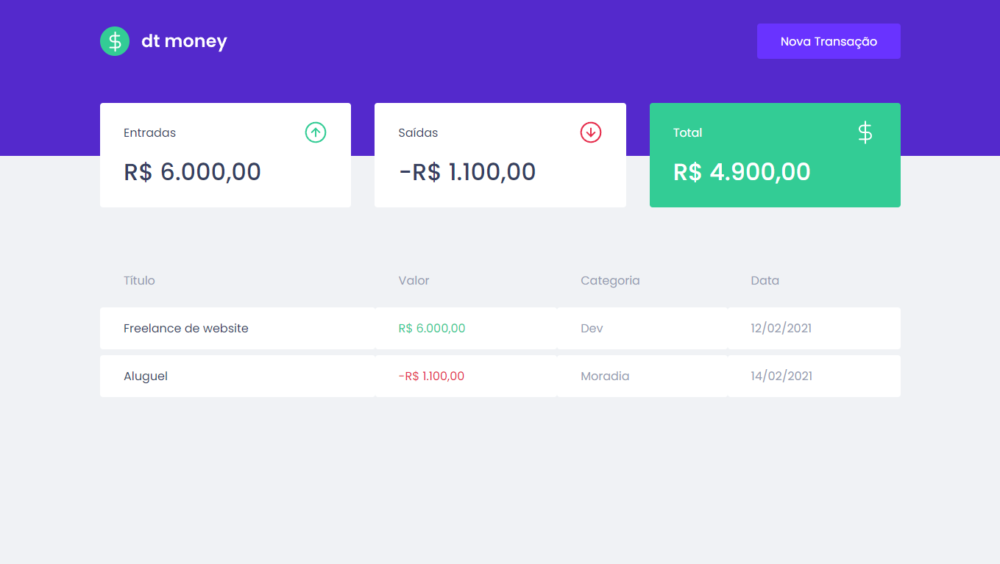

## Dtmoney

Uma aplicação para controle de finanças pessoais onde o usuário pode cadastrar transações de gastos e rendimentos para manter o registro e obter o total.

Aplicação desenvolvida no segundo capítulo do curso Ignite da Rocketseat.

[](https://github.com/lucaslousada)
[](#)
[](#)
[](#)
[](LICENSE.md)

<div>
  
</div>
<p align="center">
  Você pode visualizar o layout do projeto através <a href="https://www.figma.com/file/0xmu9mj2TJYoIOubBFWsk5/dtmoney-Ignite-(Copy)?node-id=0%3A1">deste link<a>.
</p>

## Tecnologias

Esse projeto foi desenvolvido com as seguintes tecnologias:

- ReactJS
- TypeScript
- Miragejs
- Axios
- Styled Components
- Polished
- React Modal

## Executar o projeto

Você precisa instalar o [Git](https://git-scm.com/downloads) e o [Node.js](https://nodejs.org/en/download/) para executar este projeto.
Você pode usar [Yarn](https://yarnpkg.com/) ou [Npm](https://nodejs.org/en/download/).

```bash
# Clone o projeto e acesse a pasta
$ git clone https://github.com/lucaslousada/dtmoney.git && cd dtmoney
# Instale as dependências
$ yarn
# Inicie a aplicação
$ yarn start
```

Aplicação: http://localhost:3000

## Licença

Este projeto está licenciado sob a Licença MIT - veja o arquivo [LICENSE](LICENSE.md) para mais detalhes.
